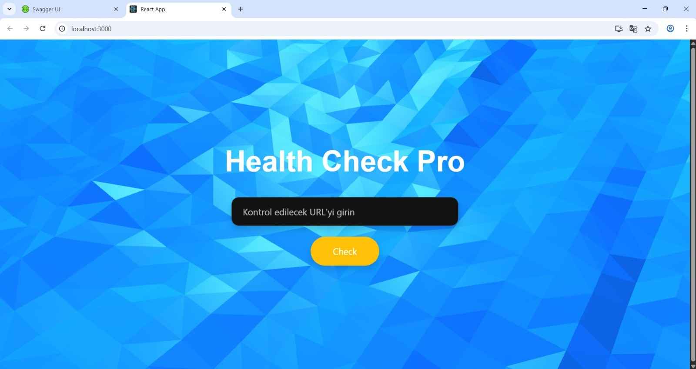

# React UI – Mouse-Interactive Animated Background

A modern, lightweight, and interactive **React** interface with a background animation that responds to mouse movements (e.g., **Vanta.js WAVES**). Built for smooth performance and a minimal, clean layout.  
**No API required** — purely frontend.



## Features
- Mouse-responsive, GPU-accelerated animated background  
- Clean single-page layout (SPA)  
- Component-based architecture for easy customization  
- Animation powered by `Vanta.js` and `three.js`  
- Smooth transitions using `Framer Motion`

## Installation
```bash
# Install dependencies
npm install

# Start development server
npm run dev

# Build for production
npm run build

# (Optional) Preview the production build
npm run preview
